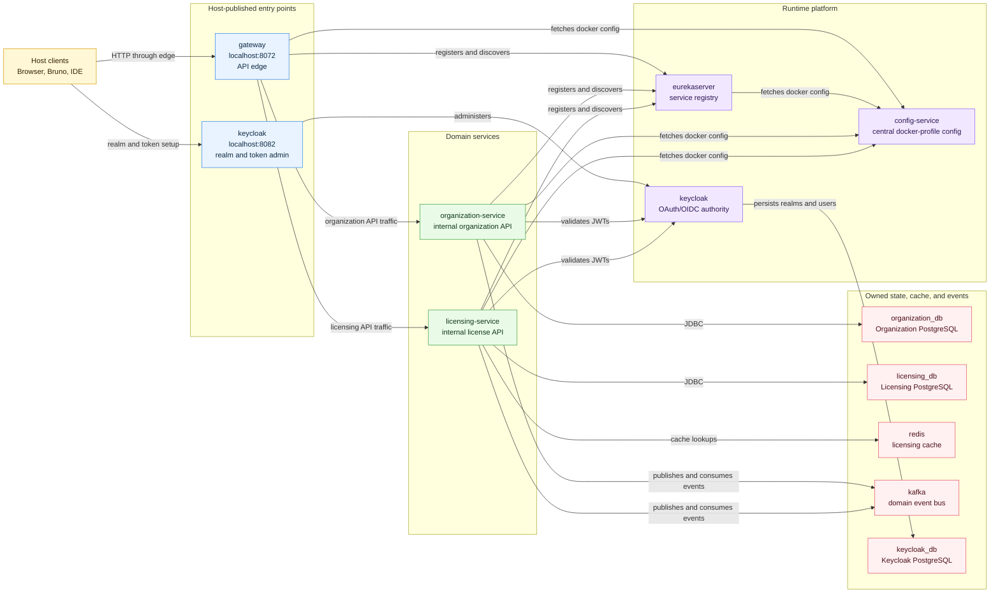
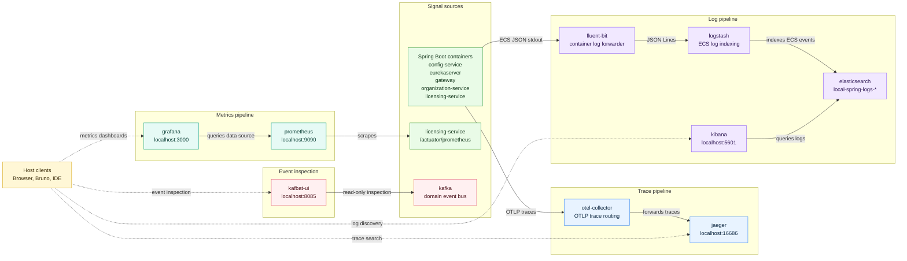

# Deployment

## Overview

The `deployment` directory packages a Docker Compose stack that wires together the Config Server, Eureka, Gateway, Keycloak, Kafka, Redis, the service containers, PostgreSQL instances, and local observability tools. Use it when you need the full microservices suite running locally.

## Topology

The stack is intentionally shaped around a small set of durable boundaries: host API traffic enters through the Gateway, containers talk through Compose DNS names, platform services provide config/auth/discovery, each service owns its state, and telemetry is collected without changing application call paths.

### Runtime Topology

This view focuses on request flow, service coordination, state ownership, and messaging.



### Observability Pipelines

This view separates telemetry collection and inspection from the request path.



## Prerequisites

- Docker
- The `ostock/*` images available locally or pulled from a registry (`config-server`, `eureka-server`, `gateway`, `organization-service`, `licensing-service`).

## Dependency Updates

Renovate scans the Compose files for container image updates. Local application images under `ostock/*` are ignored because they are built from the owning service repositories.

Renovate groups related infrastructure image updates into focused PRs:

- `ELK Stack`
- `Observability Stack`

PostgreSQL, Keycloak, Kafka, Kafbat UI, and Redis updates are intentionally left separate so runtime issues are easier to diagnose.

## Run The Stack

From this directory execute:

```sh
docker compose up
```

This command starts the PostgreSQL containers, waits for the Config Server health check to pass, and then launches the dependent services.

The Eureka, Organization Service, Licensing Service, and Gateway containers run with the `docker` profile enabled, so they load network-aware configuration served by the Config Server. The Gateway routes full-stack host API traffic to the domain services through Eureka service names.

Keycloak runs in development mode at `http://localhost:8082` with the bootstrap admin account `admin` / `admin`. Other containers on the Compose network can reach it at `http://keycloak:8080`.

Kafka runs as a single-node broker for local development. It is available to the Organization and Licensing service containers at `kafka:9092`. Host tools can connect at `localhost:29092`. Kafbat UI is available at `http://localhost:8085` and connects to Kafka through the Compose network.

Redis runs for local development at `localhost:6379`. The Licensing Service container reaches it at `redis:6379` through `SPRING_DATA_REDIS_HOST` and `SPRING_DATA_REDIS_PORT`.

Jaeger runs with in-memory trace storage at `http://localhost:16686`. Spring Boot containers with OpenTelemetry instrumentation export OTLP traces to the OpenTelemetry Collector at `http://otel-collector:4317` on the Compose network. The Collector forwards traces to Jaeger. Host-launched applications can export OTLP/gRPC traces to `http://localhost:4317` or OTLP/HTTP traces to `http://localhost:4318`.

Prometheus runs at `http://localhost:9090`. In the full stack, Prometheus scrapes the Licensing Service at `licensing-service:8080/actuator/prometheus`. Metrics are pulled by Prometheus; they are not pushed through Logstash or the OpenTelemetry Collector in this local setup.

Grafana runs at `http://localhost:3000` with anonymous admin access enabled for local development; the login form is disabled. Grafana is provisioned with Prometheus as its default data source and a `Licensing Service Metrics` dashboard.

The Elastic stack runs with local-development security disabled. Kibana is available at `http://localhost:5601`, and Elasticsearch is available at `http://localhost:9200`. The full-stack Compose file forwards Config Server, Eureka, Gateway, Organization Service, and Licensing Service stdout and stderr logs to Fluent Bit with Docker's Fluentd-compatible logging driver. Fluent Bit parses Spring Boot ECS JSON log lines and forwards JSON Lines to Logstash at `logstash:5000`; Logstash indexes ECS events into daily `local-spring-logs-*` indices. Create a Kibana data view for `local-spring-logs-*` to browse aggregated logs.

The default container logging path for Spring Boot containers using the Compose log aggregation settings is:

```text
Spring Boot ECS JSON stdout
-> Docker Fluentd logging driver
-> Fluent Bit
-> Logstash
-> Elasticsearch/Kibana
```

The tracing path is:

```text
Spring Boot OTLP
-> OpenTelemetry Collector
-> Jaeger
```

The metrics path is:

```text
Spring Boot Actuator Prometheus endpoint
-> Prometheus scrape
-> Prometheus UI or Grafana dashboard
```

The gateway is exposed at `http://localhost:8072` and is the host entry point for full-stack domain API requests. The Organization Service and Licensing Service containers are not published directly to the host in the full stack; other containers reach them by Compose DNS name. Example gateway URLs:

```text
http://localhost:8072/organization-service/v1/organization/{organizationId}
http://localhost:8072/licensing-service/v1/organization/{organizationId}/license/{licenseId}
```

## Bruno API Collection

The `bruno/` collection contains host-side requests for the local Compose deployment. Use the `gateway/` requests for full-stack domain APIs; the duplicated `gateway/licensing/` and `gateway/organization/` folders call API endpoints through `http://localhost:8072`. Service actuator requests stay out of the gateway path. The top-level `licensing/` and `organization/` folders keep direct-service requests for IDE-launched services on host ports `8080` and `8081`.

Collection-wide pre-request auth in `bruno/opencollection.yml` refreshes `admin_token` by running `keycloak/admin auth` when a protected request uses bearer auth. Protected requests reference that token with `{{admin_token}}`.

The Keycloak container bootstraps only the Keycloak admin account. Bruno auth requests assume the `spring-microservices` realm, `ostock` client, and local users such as `admin@ostock.com` already exist in the shared `deployment_keycloak_data` volume. On a fresh Keycloak volume, create or import that realm before running protected Bruno requests.

## Run Local Infrastructure

To start the shared infrastructure needed by services launched from an IDE, use the local Compose file:

```sh
docker compose -f docker-compose.local.yml up
```

This starts Keycloak, Kafka, Redis, Kafbat UI, Jaeger, Elasticsearch, Logstash, Kibana, Prometheus, Grafana, and Keycloak's PostgreSQL database without starting the application containers. IDE-launched services using the `dev` profile can connect to Keycloak at `http://localhost:8082`, Kafka at `localhost:29092`, and Redis at `localhost:6379`. Kafbat UI is available at `http://localhost:8085`, Jaeger is available at `http://localhost:16686`, Kibana is available at `http://localhost:5601`, Elasticsearch is available at `http://localhost:9200`, Logstash accepts JSON Lines at `localhost:5000`, Prometheus is available at `http://localhost:9090`, and Grafana is available at `http://localhost:3000`.

The local infrastructure stack does not run the OpenTelemetry Collector or Fluent Bit. Jaeger accepts OTLP/gRPC traces directly at `localhost:4317` and OTLP/HTTP traces directly at `localhost:4318`. Host-launched applications are not captured from stdout by Docker; if you need their logs in Elasticsearch, send ECS JSON Lines to Logstash at `localhost:5000` or run a local log forwarder for the IDE process.

For IDE-launched Licensing Service metrics, Prometheus scrapes `host.docker.internal:8080/actuator/prometheus` through `compose/prometheus/prometheus-local.yml`. If the application uses another port, update that target.

For IDE-launched Spring Boot applications with OpenTelemetry enabled, use:

```sh
OTEL_TRACES_EXPORTER=otlp
OTEL_EXPORTER_OTLP_PROTOCOL=grpc
OTEL_EXPORTER_OTLP_ENDPOINT=http://localhost:4317
OTEL_TRACES_SAMPLER=always_on
```

## Application Metrics

Spring Boot applications need Actuator and the Prometheus registry on the classpath to expose `/actuator/prometheus`. The Licensing Service already includes `micrometer-registry-prometheus` and exposes `health,prometheus` through Config Server configuration.

Open Prometheus at `http://localhost:9090` and check **Status -> Targets**. Useful queries:

```promql
up
up{job="spring-boot-docker"}
jvm_memory_used_bytes{job="spring-boot-docker"}
http_server_requests_seconds_count{job="spring-boot-docker"}
```

Open Grafana at `http://localhost:3000`; anonymous admin access is enabled for local development. The `Licensing Service Metrics` dashboard is provisioned automatically. It uses Prometheus queries filtered by the `service="licensing-service"` label, and the scrape job selector lets you switch between `spring-boot-docker` and `spring-boot-dev` when both exist.

For IDE-launched applications started with `docker-compose.local.yml`, use:

```promql
up{job="spring-boot-dev"}
jvm_memory_used_bytes{job="spring-boot-dev"}
http_server_requests_seconds_count{job="spring-boot-dev"}
```

Keep OTLP metrics disabled unless you add an OTLP metrics pipeline and backend. This stack uses Prometheus pull-scraping for metrics and the OpenTelemetry Collector only for traces.

## Application Logging Choices

Spring Boot structured console logging and a direct Logback TCP appender are separate output paths.

Use Spring Boot structured console logging for applications running inside Docker:

```properties
logging.structured.format.console=ecs
```

This setting changes the application's stdout format. In the full-stack Compose file, Docker currently captures Config Server, Eureka, Gateway, Organization Service, and Licensing Service stdout and sends it to Fluent Bit. Fluent Bit then parses the JSON and forwards ECS events to Logstash. This is the preferred container path because the application only writes to stdout and the platform handles log shipping. Infrastructure containers such as Keycloak, Kafka, Redis, Elasticsearch, Logstash, Kibana, Jaeger, Prometheus, and Fluent Bit are intentionally left on Docker's default logging path so plain infrastructure logs do not collide with Spring Boot ECS fields such as `log.level`.

For IDE-launched applications, Docker does not see the process stdout. If you want IDE logs in Elasticsearch, either run a local forwarder for the IDE process or configure the application to push JSON Lines directly to Logstash at `localhost:5000`.

If a direct Logback TCP appender uses `LogstashEncoder`, the indexed documents will have Logstash-style fields such as:

```text
level
logger_name
thread_name
level_value
message
```

That direct appender is not controlled by `logging.structured.format.console`. Removing or changing `logging.structured.format.console` does not change what the TCP appender sends to Logstash.

If the application writes Spring Boot ECS JSON to stdout and that stdout is collected by Fluent Bit, the indexed documents should contain ECS-style fields such as:

```text
log.level
log.logger
process.thread.name
service.name
message
```

In Kibana Discover, the table view can make both formats look similar. Open a document's JSON view or add fields such as `log.level`, `log.logger`, `level`, and `logger_name` as columns to verify which path produced the event.

## Tear Down

```sh
docker compose down
```

## Troubleshooting

- If a service exits immediately, inspect its logs with `docker compose logs <service>`.
- Seeing Eureka retry `http://localhost:8761/eureka` usually means the docker profile is not active. Rebuild the images and confirm `spring.profiles.active=docker` is present on the affected containers.
